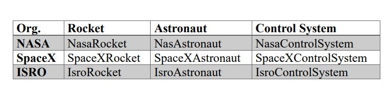
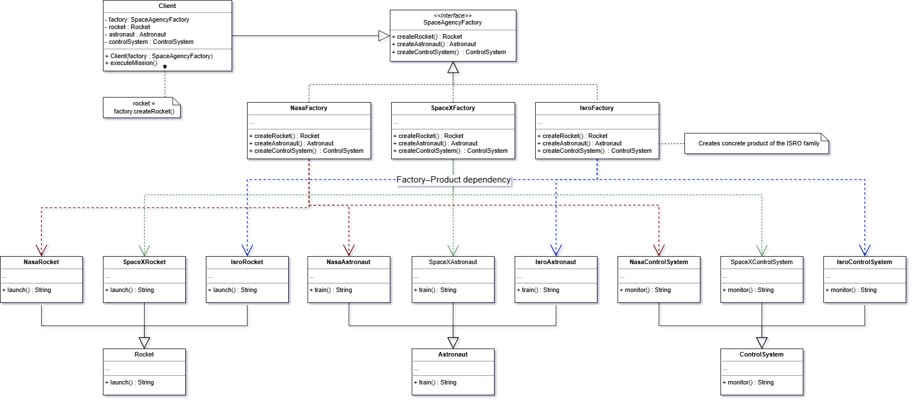

# 🏭 Abstract-Factory Method (Space Agency Example)

 Abstract-Factory Pattern คือแนวคิดการออกแบบซอฟต์แวร์ที่ใช้สำหรับสร้าง **กลุ่มของ object ที่เกี่ยวข้องกัน (family of objects)** โดยไม่ต้องระบุ class ที่เป็น concrete โดยตรง

---

## ตัวอย่าง

ในระบบการจำลองภารกิจอวกาศ (Space Mission Simulation)  มีหลายหน่วยงานที่ทำภารกิจ เช่น **NASA, SpaceX และ ISRO** 

แต่ละหน่วยงานมีองค์ประกอบของระบบที่แตกต่างกัน เช่น

-   Rocket
-   Astronaut
-   Control System
    
ระบบจึงใช้ **Abstract Factory Pattern** เพื่อสร้าง object เหล่านี้โดยไม่ต้องระบุ class ที่สร้างจริง

---

## Problem

หาก Client สร้าง object โดยตรง เช่น

- NasaRocket
- SpaceXRocket
- IsroRocket

Client จะต้องรู้ class ทุกตัว ทำให้เกิด **tight coupling** และเมื่อเพิ่ม Space Agency ใหม่ จะต้องแก้โค้ดหลายส่วนของระบบ

---

## Solution

ใช้ **Abstract Factory Pattern** เพื่อสร้าง interface สำหรับการสร้าง object

Factory จะกำหนด method เช่น

- createRocket()
- createAstronaut()
- createControlSystem()

Concrete Factory เช่น

- NasaFactory
- SpaceXFactory
- IsroFactory

จะเป็นผู้กำหนดว่าควรสร้าง object แบบใด



---

## Structure (Diagram)



---

## Diagram Explanation
### Abstract Factory  
`SpaceAgencyFactory` เป็น interface ที่กำหนด method สำหรับสร้าง object  
  
- createRocket()  
- createAstronaut()  
- createControlSystem()  
  
### Concrete Factory  
- NasaFactory  
- SpaceXFactory  
- IsroFactory  
  
แต่ละ factory จะสร้าง product ของหน่วยงานตนเอง  
  
### Abstract Products  
- Rocket  
- Astronaut  
- ControlSystem  
  
### Concrete Products  
Rocket  
- NasaRocket  
- SpaceXRocket  
- IsroRocket  
  
Astronaut  
- NasaAstronaut  
- SpaceXAstronaut  
- IsroAstronaut  
  
Control System  
- NasaControlSystem  
- SpaceXControlSystem  
- IsroControlSystem  
  
### Client  
Client ใช้ factory เพื่อสร้าง component ของภารกิจอวกาศ และดำเนินภารกิจผ่าน method `executeMission()`

## Example Execution
```java
public static void main(String[] args){
        SpaceAgencyFactory factory = new NasaFactory();
        Client client = new Client(factory);
        client.executeMission();

        factory = new SpaceXFactory();
        client = new Client(factory);
        client.executeMission();

        factory = new IsroFactory();
        client = new Client(factory);
        client.executeMission();
}
```
```java
-----Create Mission Components-----
NASA Astronaut training intensely.
NASA Rocket launching with precision.
NASA Control System monitoring mission.
----------let go!!----------

-----Create Mission Components-----
SpaceX Astronaut preparing for Mars.
SpaceX Falcon rocket launching!
SpaceX AI control system active.
----------let go!!----------

-----Create Mission Components-----
Indian Space Research Organisation Astronaut undergoing rigorous training.
Indian Space Research Organisation Rocket launching cost-effectively.
Indian Space Research Organisation Control System tracking mission.
----------let go!!----------
```
---
## Advantages

1.  **Loose Coupling**  
    Client ไม่จำเป็นต้องรู้ class ที่ถูกสร้างจริง เช่น NasaRocket หรือ SpaceXRocket เพราะใช้งานผ่าน interface ของ Abstract Factory
    
2.  **Consistency of Product Families**  
    Factory จะสร้าง product ที่อยู่ใน family เดียวกันเสมอ เช่น NasaFactory จะสร้าง NasaRocket, NasaAstronaut และ NasaControlSystem เท่านั้น
    
3.  **Easy to Switch Product Families**  
    สามารถเปลี่ยน Space Agency ได้ง่าย เพียงเปลี่ยน factory เช่น NasaFactory → SpaceXFactory
    
4.  **Improves Code Maintainability**  
    โค้ดมีโครงสร้างชัดเจน แยกการสร้าง object ออกจากการใช้งาน
    
5.  **Supports Scalability**  
    สามารถเพิ่ม Space Agency ใหม่ เช่น ESAFactory ได้โดยไม่ต้องแก้ไขโค้ดของ Client
    
---

## Disadvantages

1.  **More Classes in the System**  
    ต้องสร้าง class จำนวนมาก เช่น Factory, Product และ Concrete Product
    
2.  **Difficult to Add New Product Types**  
    หากต้องเพิ่ม product ใหม่ เช่น Satellite จะต้องแก้ไข interface `SpaceAgencyFactory` และ factory ทุกตัว
    
3.  **Higher Initial Complexity**  
    สำหรับโปรเจกต์ขนาดเล็ก การใช้ Abstract Factory อาจทำให้โค้ดดูซับซ้อนเกินไป
    
4.  **More Setup Required**  
    ต้องสร้าง Abstract Factory, Concrete Factory และ Product หลาย class ก่อนที่จะใช้งานระบบได้
